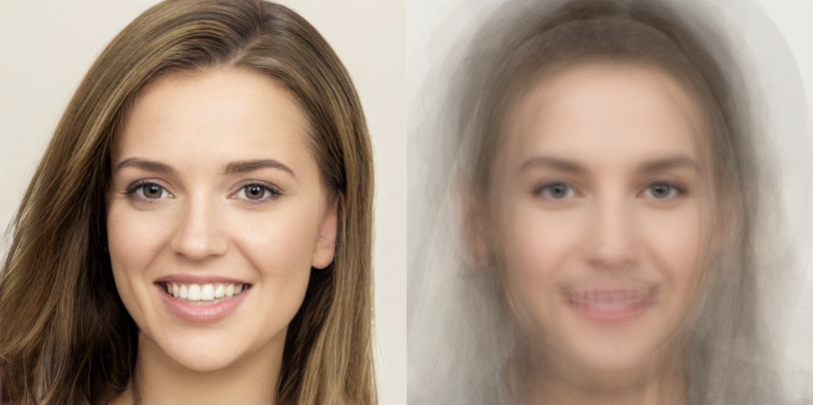

# Average Face

## About

This application is an average face generator created using the p5.js library. 

The left side of the canvas shows a random image from a predefined set of 30 images. Pressing any key changes this image to another random image from the set.

The right side of the canvas shows the average of the 30 images from the set. The average image is generated by calculating the average colour value of each pixel. Moving the cursor along the width of the canvas shows a smooth transition from the random image to the average image.